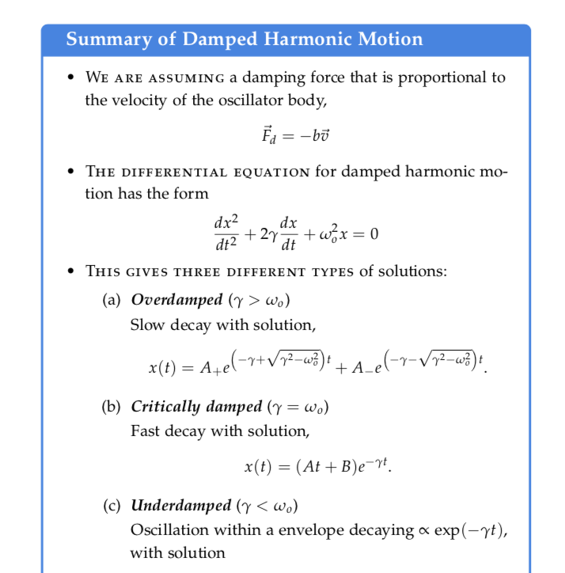
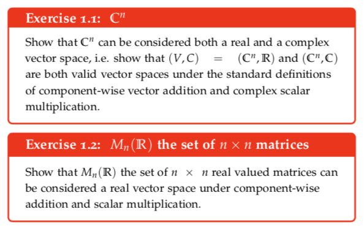
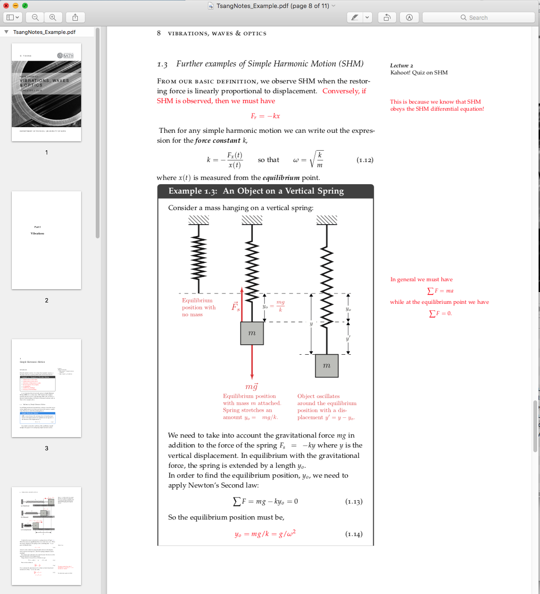
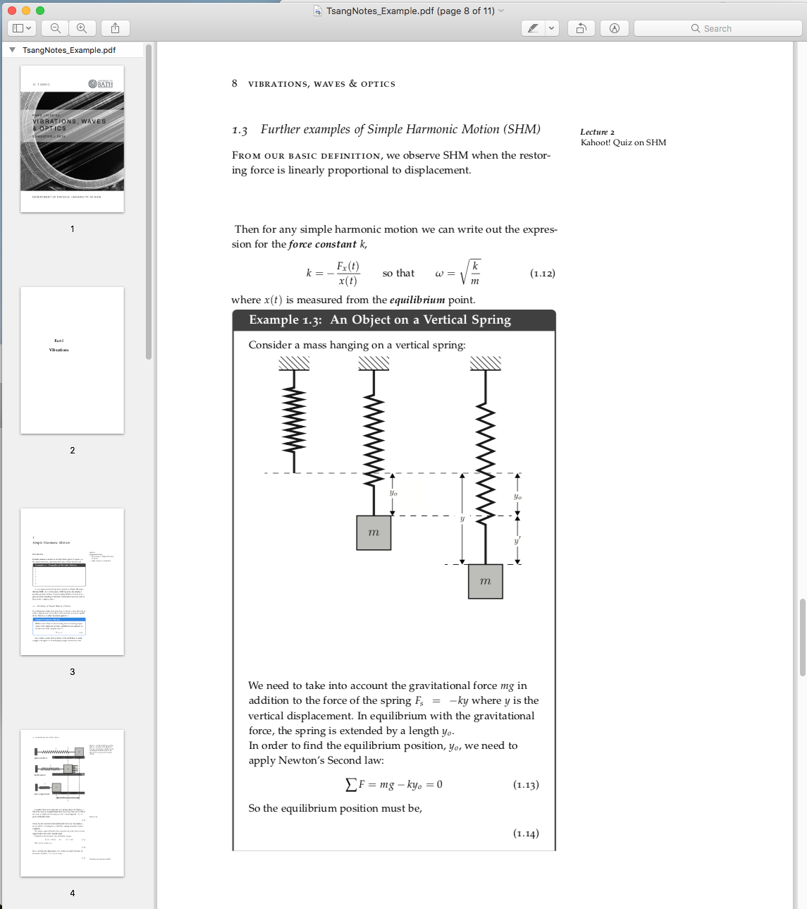

# Dave's LaTeX Class Notes Template v1.0

David Tsang University of Bath - D.Tsang@bath.ac.uk

2018/08/24

This is a template for skeletal class notes based on the tufte-book class.
Copy "TsangNotes.sty" and "TsangNotes.cls" into your local LaTeX directory.

     \documentclass[options..]{TsangNotes}

(see also Dave's Problem Set template: https://github.com/davtsang/TsangPS)

# Class Options:

  	skeletal : skeletal notes, sets text color of things in \p{...} to white
	          (except for align environment equation numbers).
		  Also uses un-annotated image from \pincludegraphics{...}{..}
		  (see below)

	full : force full notes, sets text color of things in \p{...} to red
	       (except for align environment equation numbers).
	       Also uses annotated image from \pincludegraphics{...}{...}
	       (also sets flag \pfig=true for use with the draftfigure package)

	accessible : sets all the text to sans serif, including equations, also
	             puts a line in the margin between the main text and the
		     marginal text. \frontmatter and \backmatter have the margin
		     line removed, while \mainmatter turns it on. 
		     It is recommended that you set the papersize to b5paper, then print
		     to 120% in order to make the fonts bigger for accessibilty
		     (The tufte-book fonts don't scale well unless you decide to use
		     XeTeX)

All other options will be passed to tufte-book (e.g. the ones for UK notes are usually "a4paper, openany, notoc")

If no TsangNotes class specific options are set, it will default to the "full" behaviour. As an alternative to the class options (for command line options and makefiles) you can set the definitions (BEFORE \documentclass is called)

	\def\student{}  in order to set skeletal notes on

	\def\accessible{} in order to set accessible fonts on

Note that the class options override the \defs above  if they conflict.

# Class Commands:

       \logo[OFFSET]{PATH} sets the path to the logo file to load next to
       the title you can use the OFFSET in length units (cm, pts etc)
       in order to shift the image up or down

       \coverimage[SCALE]{PATH} sets the background cover image for the
       title page. SCALE (with fixed aspect ratio) by a fraction of the
       page width
       
       \overtitle{OVERTITLE} sets the overtitle for the cover page
       \title{TITLE} sets the title for the cover page
       \undertitle{UNDERTITLE} sets the undertitle for the cover page

       \partcover[SCALE]{PATH} sets the background cover image for the
       part title page. Useful for multipart courses. If no partcover
       is set, it will \part{...} will just have a white background.

       \p{...} hides the text if the notes are the "skeletal" version
       (by setting text color to white). You can use this surrounding
       entire align environments, but the equation numbers will stay black.
       In the "full" version everything in \p{...} will appear red. 

       \pincludegraphics{UNANNOTATED_PATH}{ANNOTATED_PATH} places graphics
       that are either UNANNOTATED_PATH for "skeletal" version, or
       ANNOTATED_PATH for the "full" version. IT IS RECOMMENDED THAT THESE
       HAVE THE SAME BOUNDING BOXES/SIZE in order for the skeletal version
       to maintain the same layout as the full version.
       (If you would prefer to have a blank frame to replace the figure with,
       please use the the draftfigure package instead
       
		\usepackage[allfiguresdraft]{draftfig})

       using
       
       		\includegraphics[draft=false]
	      
       for figures that should always appear and
       
       		\includegraphics[draft=\pfig]

       for figures that should appear only in the full version.)

       \begin{fullfigure}...\end{fullfigure} wraps the figure* environment to 
       provide a white coloured background (mdboxed) box with no frame. This is 
       only useful for the accessible option as it prevents the margin line from 
       showing through transparent graphics

## tufte-book class commands
	
	\marginnote[OFFSET]{...} places a note in the margin with a particular vertical offset
	
	\sidenote[OFFSET]{...} places a sidenote with a corresponding label in the margin (replaces \footnote{})
	
	\begin{marginfigure}...\end{marginfigure} places a figure environment in the margin
	
	\begin{figure}...\end{figure} places a figure environment that spans the main text
	
	\begin{figure*}...\end{figure*} places a figure environment that spans the page

# Boxes

Several TikZ boxes are provided for displaying examples, exercises and
emphasis.

## mybox

	\begin{mybox}[width=WIDTH]{TITLE}

	...
	
	\end{mybox}

This provides an unnumbered box with heading: "TITLE" with a blue/ocean coloured border. The box has width \textwidth by default. Set this to \pagewidth if you want it to span the page.

## examplebox

	\begin{examplebox}[width=WIDTH]{TITLE}

	...
	
	\end{examplebox}

This provides a numbered example box with heading: "Example CHAP.EXNUM: TITLE"
that is by default has width \textwidth. Set this to \pagewidth if you want it to span the page.

## exercisebox

	\begin{exercisebox}[width=WIDTH]{TITLE}

	...
	
	\end{exercisebox}

This provides a numbered example box with heading: "Exercise CHAP.EXERCISENUM: TITLE"
that is by default has width \textwidth. Set this to \pagewidth if you want it to span the page. This box has a red border.

# Samples:

## full

## skeletal

## accessible

 example screenshot")

The example text and figures are  © 2018 David Tsang. Cover image "guitarstrings.jpg" modified from "12 String Theory" by Paul VanDerWerf (http://www.flickr.com/photos/pavdw/23500305076/), licensed under a Creative Commons Attribution 2.0 License (http://creativecommons. org/licenses/by/2.0/legalcode). The University of Bath logo is a trademark of the University of Bath. 
